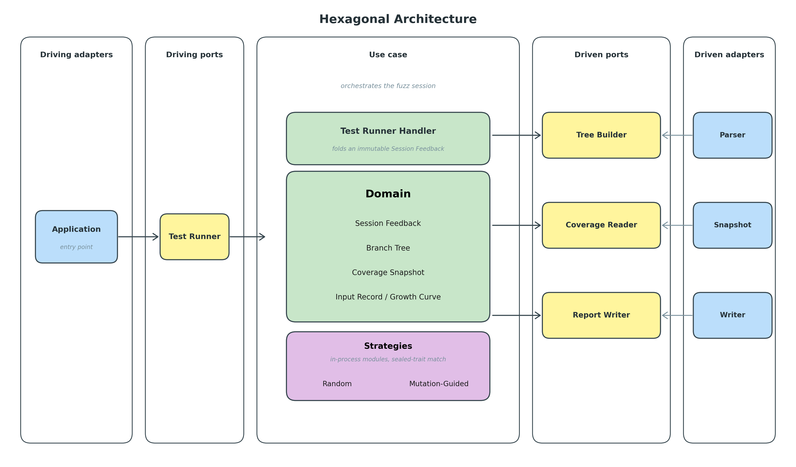
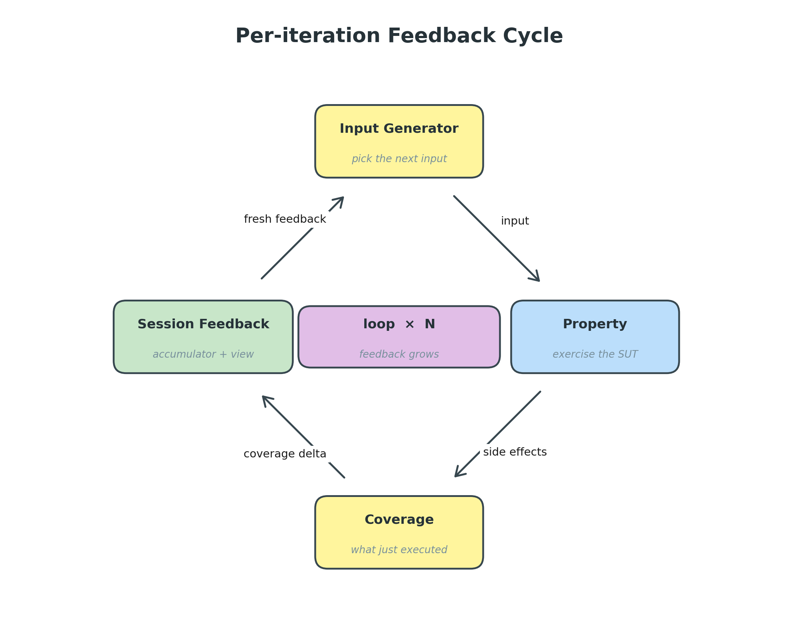

# Architecture

Technical companion to [`overview.md`](overview.md). The overview
explains *what* the project does in plain terms; this document
explains *how* it's built.

---

## 1. What is in the codebase

A single sbt build with two subprojects:

| Subproject | Role                                                                                        |
|------------|---------------------------------------------------------------------------------------------|
| `sut`      | System under test — benchmark methods grouped by problem kind. Compiled with scoverage instrumentation. |
| `engine`   | Framework — domain types, ports, adapters, the use case, the `app.Main` composition root.   |

Almost all interesting code lives in `engine/`. The SUT is a
catalogue of small methods, one file per *kind of problem* random
PBT faces (`Saturated`, `MagicConstants`, `NarrowRanges`,
`Relational`, `StructuralInvariants`, `DeepConditionals`,
`StagedValidity`) plus a `Tree` data type. `app.Main` is the only
file that imports concrete adapter classes; it is also the entry
point (a plain `def main(args: Array[String])`). One invocation
runs every benchmark against one (strategy, seed) pair from the
CLI args.

The driven ports and their adapters:

| Port                       | Adapter                              | What it does                                        |
|----------------------------|--------------------------------------|-----------------------------------------------------|
| `BranchTreeBuilder`        | `ScalametaBranchTreeBuilder`         | Parses source to a `BranchTree` via Scalameta       |
| `SourceCoverageReader`     | `ScoverageSourceCoverageReader`      | Reads fired statement offsets per source file       |
| `CoverageReportWriter`     | `FileSystemCoverageReportWriter`     | Writes one `coverage.json` per cell                 |

The single driving port `TestRunner` has one adapter:
`FileSystemTestRunner`. It delegates to the use-case
`TestRunnerHandler`, which is written entirely in terms of the
three driven ports above.

Strategies are not behind a port — they live on the `Strategy[A]`
sealed trait directly (§4).

---

## 2. Ports and adapters in plain terms

A **port** is a contract: "I need something that does X." An
**adapter** is a concrete implementation of that contract.

The discipline: the core of the application is written in terms of
ports only. It does not know that the AST shape comes from
Scalameta, or that the report goes to disk. It only knows there is
a tree builder it can ask to parse a method, a coverage reader it
can ask for fired statements, a writer it can hand a finished
report to.

Adapters fit a port without leaking concrete details into it. The
scoverage adapter exposes `coverage(sourceFile): Set[Pos]`,
not `getScoverageStatement`. Generic word, generic shape.

The result is a small core in the middle (the "hexagon"),
surrounded by adapters that plug it into the real world. Swap an
adapter, leave the core alone.



---

## 3. The three driven ports

### `BranchTreeBuilder`

Takes a Scala source file and a method name, returns a
[`ParsedMethod`](../engine/src/main/scala/domain/ParsedMethod.scala)
— the method's branch tree of branchy expressions (`if`, `match`,
`while`, `for`-comprehensions, partial functions) **plus the
literals mined from its body** (`ints`, `longs`, `doubles`, `strings` — what the
`*-pool` strategies inject). Two rules keep the tree honest:

- *Branches split, sequences don't.* A decision point becomes a
  `Branch` with one arm per outcome; everything non-branchy is a
  flat `Leaf`. An `if` with no `else` drops its synthetic else arm.
  A `for`-comprehension desugars to `withFilter`/`map` calls that
  scoverage records as one statement, so its body becomes one leaf
  over the whole comprehension; branches *inside* a fold/`for` body
  still surface.
- *Nested `def`s are opaque.* They are separate methods, so the
  walker does not descend into them; only the *call* shows up, as a
  leaf in the enclosing body.

Each leaf records its source span (`pos`..`end`). Backed by
Scalameta today; could be the Scala 3 compiler without touching the
use case.

### `SourceCoverageReader`

One operation: `coverage(sourceFile)` returns the offsets of every
statement scoverage has fired so far in that file. The use case
marks a leaf covered when one of those offsets falls **inside the
leaf's span** — matching by *file + span containment*, never by
scoverage's method attribution (which is unreliable around nested
`def`s, where it mis-files the enclosing method's own statements).
Leaf spans are method-local, so this scopes correctly on its own.
The reader is called once per iteration so the per-input delta can
be computed.

### `CoverageReportWriter`

Takes a finished `SessionReport[A]` and persists it. Today's
adapter writes one `coverage.json` per (method, strategy) — see
§6. All graphics, tables, and cross-strategy aggregations are
produced downstream by the Python scripts under
[`engine/reports/scripts/`](../engine/reports/scripts/). A future
adapter could push to a database, an HTML dashboard, or
Prometheus — one new adapter, zero changes to the use case.

---

## 4. Strategies — sealed-trait dispatch, not a port

Each `Strategy[A]` case class carries its own `gen` method:

```
val gen: Gen[A] = strategy.gen(feedback)
```

Every case holds a
[`Generatable[A]`](../engine/src/main/scala/domain/Generatable.scala)
— the one type class that bundles a uniform draw (`arbitrary`), a
mutation (`mutate`), and a pool-aware draw (`pooled`), folding into
one what used to be three separate type classes (`Arbitrary` +
`Mutator` + `Pooled`). The two `*-pool` cases also hold the mined
`ConstantPool`. So the whole engine carries a single context bound,
`[A: Generatable]`, instead of a copy-pasted trio.

**Why not a port?** Strategies are pure in-process modules with no
side effects to hide. The use case picks the input generator at
one specific point in the loop body; sealed-trait exhaustiveness
captures that decision cleanly. The four are listed once in
`Strategy.all`; `names` and `parse` derive from it, so adding a
strategy is: one new case class, one entry in `Strategy.all`, and
the same name in the Makefile's `STRATEGIES` list.

The `TestRunner` port's `property: A => Boolean` signature is
honest about what a client passes in. Today the engine always
returns `true` to ScalaCheck so coverage measurement keeps going
regardless of the predicate's outcome, but a future client wiring
a real assertion is free to depend on the boolean being honoured.

---

## 5. The system in motion

### 5a. One JVM per strategy

scoverage's `Invoker` accumulates statement hits within a JVM and
has no notion of a "session", so running two strategies inside the
same JVM would leak the first strategy's coverage into the
second's view. The composition root sidesteps this by running one
strategy per invocation:

```
sbt "engine/runMain app.Main random"
sbt "engine/runMain app.Main mutation-guided"
```

Each invocation forks a fresh JVM (`fork := true` in `build.sbt`)
and runs every benchmark against that one strategy. The Makefile's
`run` target loops over `STRATEGIES`.

Per-method scoping inside one JVM needs no method filtering: the
reader returns the whole file's fired offsets, and each method's
leaf spans only match offsets within its own body (other methods
in the same file live in disjoint source ranges).

### 5b. The per-iteration feedback cycle



The loop is ScalaCheck's own driver — `Test.check` running a
`Prop.forAllNoShrink` whose generator is
`Gen.delay(strategy.gen(feedback))` — not a hand-rolled fold. That
is the point: the `random` strategy is then *literally*
`Prop.forAll(arbitrary)`, the exact thing a ScalaCheck user writes,
so the baseline the thesis measures against is the real tool, not
an approximation of it. Coverage observation rides along as a side
effect in the property body, which always returns `true` (the
engine measures coverage regardless of the predicate's verdict).

`SessionFeedback` is the running accumulator grown by `append`:
`history: Vector[Set[Pos]]` (each input's newly-covered-branch
delta — what drives the growth curve and per-leaf first-hit),
`seeds: Vector[A]` (the inputs whose iteration newly covered a
branch — the corpus the mutation strategies perturb), and the
cumulative `coveredBranches: Set[Pos]`, kept as a field so `append`
is O(delta) rather than re-derived each call. `growthCurve` is
derived. `Gen.delay` re-reads the live feedback on every draw, so
the mutation strategies see the corpus grow; `Random` / `RandomPool`
ignore it.

---

## 6. The data the framework produces

`SessionReport[A]` is pure data — six fields, zero methods, no I/O
types:

```
methodName, sourceName   ── identity (plain strings, not a Path)
branchTree               ── static AST analysis (Option[BranchTree])
strategy                 ── which strategy ran this session (name string)
pool                     ── literals the strategy was given (empty for non-pool)
feedback                 ── loop history
```

Every derived number you might want — covered / total counts,
saturation index, per-branch first-hit, smoothed growth curve — is
computed downstream by the Python scripts under
[`engine/reports/scripts/`](../engine/reports/scripts/). The engine
emits the raw observation once; analysis lives in Python so it can
be re-run, restyled, and extended without touching the engine.

A *leaf* of `BranchTree` is the canonical "branch" for coverage:
each leaf is one distinct path through the method body, and the
decision points (rectangles in the rendered tree) are not counted
— they're intermediate nodes, not paths. The handler marks a leaf
covered when a fired scoverage offset lands inside its span (§3),
feeding that set into `SessionFeedback`, so the loop never sees
non-leaf hits. The unit reported throughout the framework is
therefore **leaf-only branch coverage** — distinct paths through
the method body — *not* scoverage's raw statement-level coverage,
which would also count the intermediate decision-point statements.

### What ends up on disk

One file per cell, written by the engine:

```
engine/reports/statistics/<category>/<methodName>/<strategy>/seed=<NN>/coverage.json
```

JSON shape:

```
{
  "method":       string,
  "sourceFile":   string,
  "strategy":     string,
  "totalInputs":  int,
  "growthCurve":  [int, …],   cumulative leaf-count per iteration
  "constantPool": { "ints": [...], "longs": [...], "doubles": [...], "strings": [...] },
  "branchTree":   nested      every leaf carries firstHitInput: int | null
}
```

`make analyze` (or `python3 engine/reports/scripts/compare.py`)
walks those JSONs and writes, alongside each cell:

```
coverage.dot       branch tree (Graphviz)
coverage.svg       rendered tree, leaves coloured by coverage
```

…plus, under `engine/reports/statistics/_summary/`:

```
by_bench/<bench>.svg   horizontal bars per (method, strategy); each bar's
                       label carries peak coverage %, the input that
                       reached it, and (for non-random strategies) the
                       speed comparison against random
suite.svg              horizontal bars per (bench, strategy)
overall.svg            one bar per strategy across the whole suite
```

The split is deliberate: the engine produces the *measurement*,
the Python scripts produce the *presentation*. Either side can be
rewritten without touching the other.

---

## 7. Extension points

| You want to add…                              | Touch                                                                          |
|-----------------------------------------------|--------------------------------------------------------------------------------|
| A new Scala branchy construct                 | One case in `ScalametaBranchTreeBuilder.visit` (+ a new `BranchTree` node only if its shape is genuinely different) |
| A new input type                              | Provide a `Generatable[A]` via `Generatable.instance`. Built-ins (`Int`, `Long`, `Boolean`, `String`, `Double`, `Option[A]`, `List[A]`, `Map[K,V]`, tuples) live in `Generatable`; SUT-specific types are wired in `app.Generators` (see `Tree`) |
| A new input-picking strategy                  | One new `Strategy[A]` case class with its own `gen`, one entry in `Strategy.all`, the same name in the Makefile's `STRATEGIES` |
| A new coverage source                         | New `SourceCoverageReader` adapter                                              |
| A new output format (HTML, Prometheus, …)     | New `CoverageReportWriter` adapter                                              |

---

*Diagrams are generated by the Python scripts under
[`docs/scripts/`](scripts/). Run `make diagrams` to regenerate
them.*
