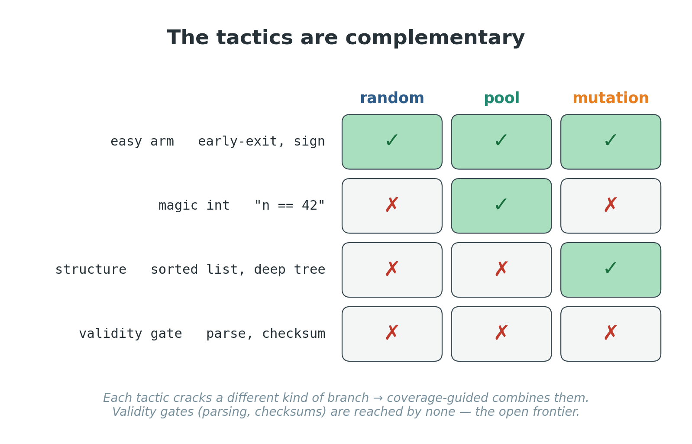
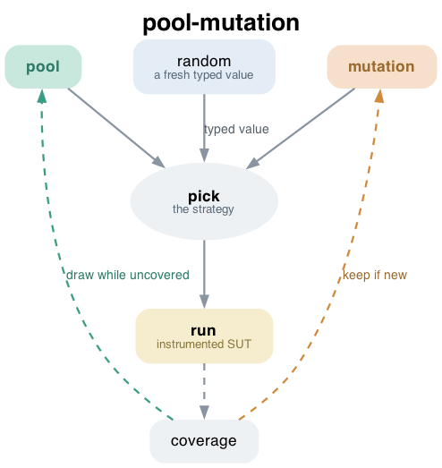

# Architecture

Technical companion to [`overview.md`](overview.md). The overview
explains *what* the project does in plain terms; this explains *how*
it is built.

---

## 1. Two subprojects

| Subproject | Role |
|------------|------|
| `sut`    | System under test — benchmark categories compiled with scoverage instrumentation. |
| `engine` | The `pbt` framework and an `app` experiment harness with concrete generators. |

The SUT catalogue has five categories: `Calibration`, `MagicLiterals`,
`MutationTargets`, `MixedTargets`, and `NumericSearch`. Each category has
at least five methods and isolates a different coverage story.

---

## 2. Using the framework — one call

```scala
val pbt    = new Pbt(Paths.get("sut"))
val report = pbt.check[Int](source, "magicInt", Strategy.pool) { n =>
  MagicLiterals.magicInt(n); true
}
```

You give a **method** (its source file + name), a **property** over
its input type, and a **strategy**. `check` generates inputs,
runs the property on each while measuring coverage, and returns a
[`Report`](../engine/src/main/scala/pbt/Report.scala). The input type
needs a [`Generatable`](../engine/src/main/scala/pbt/gen/Generatable.scala)
in scope; the supported instances (`Int`, `List`, `Option`,
`benchmark.data.Tree`, and tuples) live together in
[`app.Generators`](../engine/src/main/scala/app/Generators.scala).

`random` is ScalaCheck's arbitrary generator in the same no-shrink
measurement loop as every other strategy. Guided strategies only add
coverage-guided tactic proposals, so the baseline differs by guidance,
not by the observed SUT or reporting pipeline.

---

## 3. Strategy = One Generator Policy

A [`Strategy`](../engine/src/main/scala/pbt/strategy/Strategy.scala) is
a named policy that builds the next ScalaCheck generator from the current
[`TacticContext`](../engine/src/main/scala/pbt/strategy/Strategy.scala):

```scala
sealed trait Strategy {
  def name: String
  def next[A](context: TacticContext[A]): Gen[A]
}
```

Each draw is chosen by the selected strategy. The baseline strategy is only
`Generatable.arbitrary`. Guided strategies may combine that random draw with
a **pooled** draw and/or a **mutated** draw:

- **pool** — draw values from mined literals (`Generatable.pooled`) while some
  method-local scoverage statement is still uncovered.
- **mutation** — perturb a corpus seed, an input that grew coverage
  (`Generatable.mutate`).

So the **four strategies are the combinations of the implemented guidance
sources** — `random`, `pool`, `mutation`, and `pool-mutation`. The mixing
logic lives inside `Strategy`; [`Pbt.check`](../engine/src/main/scala/pbt/Pbt.scala)
only builds the context and asks the chosen strategy for a generator.



The tactics are **complementary** — a branch behind a magic integer is
reached only by the pool, a branch behind a *structured* input (a
sorted list, staged tuple, or tree shape) only by mutation — so the `pool-mutation`
composite covers the most.

---

## 4. The loop



Each tactic combined with the random baseline is drawn on its own —
[pool](images/pool.png), [mutation](images/mutation.png) — and
[`sources.png`](images/sources.png) contrasts stock ScalaCheck's single
random source with the guided sources.

The driver is ScalaCheck's own (`Test.check` over a
`Prop.forAllNoShrink` whose generator is `Gen.delay(...)` re-read each
draw). Shrinking is deliberately disabled because the experiment counts
the coverage effect of each generated input. Per input:

1. **draw** — ask the selected strategy for a generator using the current context;
2. **run** the property (guarded, so a thrown exception still counts);
3. **read** the scoverage statement ids fired in the method's file;
4. **mark** the method-local statement ids as covered;
5. **record** into [`Feedback`](../engine/src/main/scala/pbt/strategy/Feedback.scala).

`Feedback` is the single running signal:
`coveredAt` (statement id to first-hit input index), `corpus` (inputs that
each grew coverage — mutation perturbs these), and `iteration` (the current
input index). `Gen.delay` re-reads it every draw, so guided strategies see it
grow; `random` ignores it.

---

## 5. The pieces

Directory layout mirrors the extension points — root holds the engine,
each subpackage is one thing you would extend:

```
pbt/            engine + core types     Pbt · Coverage · Report
pbt/gen/        the generator interface Generatable · ConstantPool
pbt/analysis/   source literals         Parser
pbt/strategy/   feedback state + presets Feedback · Strategy · TacticContext
app/            harness + all the       Main · Generators
                concrete generators
sut/benchmark/  SUT methods + data      Calibration · ... · data.Tree
```

Each subpackage is one cohesive file, so "where does X live" has one
answer.

---

## 6. Coverage — method-local scoverage targets

[`Coverage`](../engine/src/main/scala/pbt/Coverage.scala) filters
scoverage's instrumented statements by source file and scoverage's own
method metadata. **A method-local scoverage-backed source statement is
the unit of statement coverage.** Targets whose scoverage statement is
branch-marked also count toward branch coverage.

This is simpler and more defensible than a custom branch metric:
scoverage is the coverage source of truth.
ScalaMeta is used only to mine integer literals from the method body for the pool
tactic, because some literals in patterns or conditions are not exposed by
scoverage as standalone literal statements.

`Coverage` reads scoverage's append-only measurement files whole on
every call — they are tiny, so the simple re-read beats tracking
incremental state. Stale measurements are wiped when it is constructed,
so each run starts clean.

---

## 7. What makes a tactic coverage-guided

Both guided sources steer off the *live* coverage — they are available only while
there is something left to gain, so a strategy is genuinely
feedback-driven, not a fixed bias:

The **pool** mines every `Int` literal in the method body into
a [`ConstantPool`](../engine/src/main/scala/pbt/gen/ConstantPool.scala)
(the AFL *dictionary* idea — reuse useful constants from the program in
inputs — adapted to value-level draws; over-approximating is cheap, an
unused literal is just a wasted draw). Each pooled draw chooses one of those
literals — but only while some method-local statement is still uncovered;
once every statement is hit there is nothing a literal can unlock, so it stands down. That
is what makes pooled generation coverage-driven.

The **mutation** tactic perturbs the corpus of coverage-growing inputs
with the type's `mutate` (AFL/FuzzChick-style edits and "interesting"
edge values). It favours the *most recent* grower — the input on the
coverage frontier — so each retained seed is the springboard that
ratchets into nearby structured inputs (sort a list, grow a tree), with a
slice of draws on older seeds for diversity.

scoverage provides the method-local statement targets and covered statement ids
that drive feedback. ScalaMeta provides the integer constants used by the pool tactic.

---

## 8. Running the experiment

scoverage's `Invoker` accumulates hits per-JVM with no notion of a
session, so the harness runs **one forked JVM per (strategy, seed)**
(`fork := true`):

```
sbt "engine/runMain app.Main random 1"
sbt "engine/runMain app.Main pool-mutation 1"
```

Each invocation runs every benchmark against that one strategy and
writes one report per method. The Makefile sweeps `STRATEGIES × SEEDS`.

---

## 9. Output

`Pbt.check` returns a `Report`; the harness writes `coverage.json`
per cell at
`engine/reports/statistics/<category>/<method>/<strategy>/seed=<NN>/`:

```
{ "method", "sourceFile", "strategy", "totalInputs", "elapsedMillis",
  "pool":       { "ints": [...] },
  "statements": [ each target carries branch: bool and firstHitInput: int | null ] }
```

Final coverage percentages come from the copied scoverage XML reports. The
growth curve is **not** stored: each statement's `firstHitInput` already
encodes when coverage grew, so the cumulative curve is reconstructed
downstream — the file stays O(statements), not O(inputs).

The Makefile also snapshots scoverage's own HTML report after each
`(strategy, seed)` run under `engine/reports/statistics/_scoverage/`.

The engine emits only this raw measurement; both `make full` and `make smoke`
produce the charts and statistics downstream
([`engine/reports/scripts/compare.py`](../engine/reports/scripts/compare.py)):
under `_summary/`: statement and branch per-bench / suite / overall
coverage bars, blind-spot charts, time-to-coverage curves, per-seed CSVs,
and significance CSVs
(Vargha–Delaney Â₁₂ effect size + Mann–Whitney U p-value vs random —
the Arcuri–Briand pair for randomized algorithms).
Per-method source views come from the copied scoverage HTML reports, not
from custom DOT/SVG graphs.

The split is deliberate: the engine produces the *measurement*, Python
the *presentation*. Either side can be rewritten without the other.

---

## 10. Extension points

| You want to add… | Touch |
|------------------|-------|
| A new input type | One `implicit Generatable[A]` object in `app.Generators` — its `arbitrary` / `mutate` / `pooled` (all the concrete generators live there; composites defer to their components, see `list`/`tree`) |
| A new coverage target shape | Usually nothing: scoverage statements are filtered by method metadata |
| A new guided mechanism | Add the generator logic in `Strategy` and expose any needed state through `TacticContext` |
| A new strategy | One `Strategy` preset in `Strategy.all` (+ the name in the Makefile's `STRATEGIES`) |
| A new output format | A new writer alongside `Report` |

---

*Diagrams are generated by the Python scripts under
[`docs/scripts/`](scripts/) as part of both Makefile workflows.*
