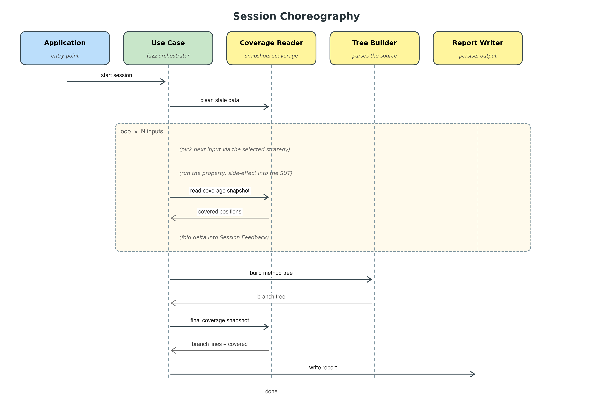

# Architecture

The technical companion to [`overview.md`](overview.md). Read the
overview first if you haven't — that document explains *what* the
project does in plain terms. This one explains *how* it's built,
why we chose that structure, and the strongest arguments against
the choice.

The document is long on purpose. It is structured so you can read it
in order from top to bottom, but you can also dip in: each section
stands on its own.

---

## 1. What is in the codebase

The repository is a single sbt build with two subprojects:

| Subproject | Role                                                                                                  |
|------------|-------------------------------------------------------------------------------------------------------|
| `sut`      | The **system under test** — small example methods. Compiled with scoverage instrumentation.           |
| `engine`   | The **framework** — domain types, ports, adapters, the use case, and the `app.Main` composition root. |

Almost all of the interesting code lives in `engine/`. The SUT is
about 200 lines of example methods plus a small bag of number-theoretic
helpers. The composition root (`engine/src/main/scala/app/Main.scala`)
is the only file in the codebase that imports concrete adapter classes
and wires them together; it doubles as the `IOApp` entry point. Each
invocation runs every benchmark against **one** strategy, picked from
the first CLI argument — see §7 for why and how that orchestrates
into a full sweep.

The driven ports and their adapters today:

| Port (what the use case needs)    | Adapter                                       | What this adapter is                                          |
|-----------------------------------|-----------------------------------------------|---------------------------------------------------------------|
| `BranchTreeBuilder`               | `ScalametaBranchTreeBuilder`                  | Static AST shape + source positions, via Scalameta            |
| `SourceCoverageReader`            | `ScoverageSourceCoverageReader`               | Per-statement invocation snapshots from scoverage             |
| `CoverageReportWriter`            | `FileSystemCoverageReportWriter`              | DOT · CSV · JSON · TXT · SVG (growth chart) to disk           |

The single driving port `TestRunner` has one adapter today:
`FileSystemTestRunner`. It delegates to the use-case class
`TestRunnerHandler`, which is the orchestrator written entirely in
terms of the three driven ports above.

Input-picking strategies — random and the two placeholders for
coverage-guided variants — are *not* driven ports. They are plain
in-process modules under `engine/src/main/scala/usecase/strategy/`
(`RandomGen`, `MutationGuidedGen`, `FeedbackBiasGuidedGen`), selected
by a sealed-trait pattern match (`domain.Strategy`) inside the
handler. The section on strategies (§6) explains why they live there
and not on the other side of a port.

---

## 2. The architectural question

The thesis is a comparison: random property-based testing versus
coverage-guided property-based testing. To do that comparison
honestly, every flavour has to run inside the *same* test harness,
producing the *same* outputs, looking at the *same* methods, with
the *same* measurement machinery in the middle. The only thing
allowed to differ is the part that chooses the next input.

Imagine writing this as a flat script: a single file that opens a
source file, parses it, starts a coverage agent, loops one hundred
times calling some random generator, writes a chart at the end.
That works for one strategy. But the moment you want to swap the
generator from random to a guided variant, you discover that the
random choice is glued into a dozen places in the file — the seed,
the generator type, the place where the loop calls it, the
assumption that the input is unrelated to past coverage. So you
copy the file, edit those dozen places, and now you have two flat
scripts that share 95 % of their text. When you find a bug in one,
you have to fix it in the other. When you want to add a third
strategy you copy again. It rots quickly.

The architectural question is: *how do we organise the framework so
that swapping a single decision — "how do we pick the next input?"
— is a single, contained change?*

The answer this project gives is **ports and adapters**, also
called hexagonal architecture, plus a small in-process sealed-trait
strategy pattern for the choice we want to vary most.

---

## 3. The pattern, in the simplest terms

A wall outlet doesn't know what you're going to plug into it. It
doesn't care whether you're connecting a toaster, a lamp, a vacuum,
or an electric guitar. It only promises one thing: at this shape of
hole, you will get electricity in a known voltage and frequency.
The "shape of the hole" is what makes it possible for appliances
and outlets to be designed independently.

That shape — the contract — is what the pattern calls a **port**.
The toaster, the lamp, the vacuum: those are **adapters**. Each
adapter implements the port in its own way, but to the building's
electrical system they all look exactly the same.

In software, a port is a piece of code that says, in effect, "I need
something that can do X, but I don't care how." An adapter is a
concrete thing that fulfils that promise.

The discipline is twofold:

- The **core logic** of the application is written entirely in terms
  of ports. It does not import any concrete adapter. It does not
  know that the AST shape comes from Scalameta, or that the report
  is written to a file. It only knows: "there's a tree builder; I
  can ask it to parse a method."
- The **adapters** are written so they fit a port without leaking
  any of their concrete-ness into it. The scoverage adapter does
  not put `getScoverageStatement` on the port. It puts
  `methodCoverage`. Generic word, generic shape.

If you follow that discipline, you end up with a system that has a
small, well-defined core in the middle (the "hexagon"), surrounded
by a thin layer of adapters that plug it into the real world. Swap
the adapter, leave the core alone; swap the core, leave the
adapters alone.

---

## 4. How the pattern lands here

The diagram below is the abstract view: it shows the pattern, not
the specific tooling. Every concrete name (Scalameta, scoverage,
the filesystem writer) lives in §1's table, not in the figure.


There are two "sides" to the hexagon:

- The **driving side** (left) is who calls *into* the framework. In
  our project this is `app.Main` — the small program that says
  "test these methods against these strategies." It calls through
  the `TestRunner` driving port, which is implemented by
  `FileSystemTestRunner`.

- The **driven side** (right) is what the framework calls *out to*.
  Three small contracts: `BranchTreeBuilder`, `SourceCoverageReader`,
  `CoverageReportWriter`.

The use case (`TestRunnerHandler`) is written entirely in terms of
these driven ports. The driving adapter (`FileSystemTestRunner`)
binds the port to filesystem-specific construction parameters
(source file path, output base directory); the *composition* —
constructing the handler with its driven adapters and the strategies
list — happens in `app.Main`.

Strategies sit inside the Use Case column in the diagram for a
reason: they are not behind a port. The handler holds an injected
trio of driven adapters, but it picks the right strategy module by
matching on the `Strategy` ADT. §6 explains the design choice.

---

## 5. The three driven ports, one by one

It's worth pausing on each port and asking: *why is this a separate
contract? Why not just bake it into the use case?*

### 5a. `BranchTreeBuilder`

**What it does.** Takes a Scala source file and a method name, and
returns the method's enclosing package, class, and a tree of its
branchy expressions (`if`, `match`, `while`, `try`, partial
functions, …). Each node carries its source position.

**Why a port.** Parsing Scala is a heavy lift; we use Scalameta.
But the *purpose* of this port is not "parse Scala" — it's
"describe the structure of a method". A toy alternative might be a
hand-rolled parser that only handles `if`/`else`; a future
alternative might be one based on the Scala 3 compiler. The port
stays the same.

**What it lets us swap.** Other parsers, or even pre-cached parse
results from disk, without touching the use case.

### 5b. `SourceCoverageReader`

**What it does.** Two operations. `cleanStaleData` wipes leftover
scoverage measurement files at the start of a session (one-shot per
JVM via a `lazy val`, because scoverage's `Invoker` caches a
`FileWriter` after first use and would otherwise be orphaned by a
later delete). `methodCoverage(sourceFile, methodName)` returns a
snapshot of source-level coverage for that method: the set of
positions invoked so far and the map of branch positions to source
lines.

**Why a port.** Source-level coverage is a domain unto itself.
scoverage is the obvious choice for Scala because of its compiler-
plugin model, but the use case shouldn't depend on scoverage's
internal types. Hiding that choice behind a port keeps the option
open (a different statement-coverage source, a sampling profiler,
…) without polluting the use case.

**Per iteration, not just at the end.** Worth being explicit: the
handler calls `methodCoverage` *inside* the property body on every
fuzz iteration, so the per-input "newly covered branches" delta can
be computed as a diff against the running set. The same port is
also called once after the loop closes to produce the final
snapshot the writer needs. Because each JVM runs only one strategy
(see §7), the scoverage state queried during a session contains
only that session's contribution — no cross-strategy bleed.

### 5c. `CoverageReportWriter`

**What it does.** Takes a finished `SessionReport[A]` and writes it
somewhere.

**Why a port.** Output is the most likely surface to change. Today
we write five files to disk. Tomorrow we might want to push the
report to a database for cross-session comparisons; or to an HTML
dashboard; or to Prometheus for monitoring. Each of those is one
new adapter and zero changes to the use case.

**What it lets us swap.** Output format and destination.

---

## 6. Strategies — pluggable, but not a driven port

The thing the thesis varies most is the input-picking strategy.
That sounds like the textbook case for a port. We chose not to
make it one. The handler picks the strategy by matching on a
sealed `Strategy` ADT:

```
val gen: Gen[A] = strategy match {
  case Strategy.Random             => RandomGen.gen[A](feedback)
  case Strategy.MutationGuided     => MutationGuidedGen.gen[A](feedback)
  case Strategy.FeedbackBiasGuided => FeedbackBiasGuidedGen.gen[A](feedback)
}
```

The three `*Gen` modules all expose the same shape — `gen[A]
(feedback: => SessionFeedback[A]): Gen[A]` — but they are plain
companion objects under `usecase/strategy/`, not implementations
of a driven trait.

**Why not a port?**

1. They are not on the other side of a process boundary. Every
   strategy is pure Scala, in the same JVM, with no I/O. A
   driven port exists to hide *something the use case shouldn't
   touch* — a database, a parser, a file system. There's no such
   thing being hidden here.
2. The handler needs the strategy decision at one specific point
   in the loop body. A sealed trait + exhaustive match makes that
   decision compile-time-checked: adding a new strategy is a
   compile error until you add the matching arm. A port-shaped
   trait wouldn't give that property.
3. The strategy receives the running `SessionFeedback` by name, so
   the closure re-evaluates each iteration and sees the latest
   accumulator. A port would have to thread the feedback through
   its method signatures every time, which is more ceremony for
   no extra flexibility.

What we *do* keep is the swappability the thesis needs. Adding a new
strategy is mechanical: a new `case object` in `Strategy` plus its
name in `Strategy.all`, a new module under `usecase/strategy/`, a
new arm in the handler's match, and the new name in the `STRATEGIES`
list in the `Makefile` (so the orchestration loop runs it too — see
§7). The current state is **three** strategies (`Random`,
`MutationGuided`, `FeedbackBiasGuided`); the latter two are
placeholders that delegate to `arb.arbitrary` so the per-strategy
report folders exist side-by-side and only one file changes when a
real algorithm lands.

---

## 7. The system in motion

Three things help here: the multi-strategy orchestration, and two
diagrams.

### 7a. One JVM per strategy

scoverage's `Invoker` accumulates statement hits within a JVM and has
no notion of a "session", so running two strategies inside the same
JVM would leak the first strategy's coverage into the second's view
of the world (every `methodCoverage` call returns the cumulative
state). The composition root sidesteps this by running **one**
strategy per invocation, picked from the first CLI argument:

```
sbt "engine/runMain app.Main random"
sbt "engine/runMain app.Main mutation-guided"
sbt "engine/runMain app.Main feedback-bias-guided"
```

Each invocation forks a fresh JVM (`fork := true` in `build.sbt`)
and runs every benchmark against that one strategy. The full sweep
is one `make run` away — the Makefile holds the list and loops over
it.

The use case stays untouched by this choice: it still computes
per-iteration deltas against the in-session running set, exactly as
the diagrams below describe. The orchestration is purely a build-
and-launch concern.

### 7b. Session choreography

The shape of one `TestRunner` call from the application down to the
written report:



The yellow band is the inner loop: pick an input (internally,
via the selected strategy), exercise the SUT as a side effect, read
a fresh coverage snapshot from the Coverage Reader, fold the delta
into the running `SessionFeedback`, repeat. After the loop closes,
the handler asks the Tree Builder for the method's static branch
tree, asks the Coverage Reader one more time for the final
snapshot, and hands a `SessionReport` to the Report Writer.

### 7c. Per-iteration feedback cycle

Zooming into the loop body alone:


`Session Feedback` is both the loop's running accumulator and the
read-only view handed to the strategy on the *next* iteration. One
shape serves both roles, which is why there is no separate "loop
state" type in the code. This is the surface through which a future
real guided strategy will steer the inputs — today every strategy
ignores it (`val _ = feedback`).

---

## 8. The data the framework produces

Schematically, a `SessionReport[A]` looks like:

```
Session report
├── method, source file, total inputs
├── method tree                    ── from static AST analysis (Option)
├── source branch counter          ── covered / total source-level branches
├── per-branch outcomes            ── (pos, line, label, firstHitInput)
├── input log                      ── (index, input, newly-covered positions)
├── growth curve                   ── cumulative covered branches over time
├── saturation input index         ── first iteration that reached the final count
└── covered source positions       ── full set of statement-coverage hits
```

The loop-internal `SessionFeedback[A]` carries the loop-shaped slice
of the same data: `history: Vector[InputRecord[A]]`,
`coveredBranches: Set[Pos]`, and `growthCurve: Vector[Int]`. Same
underlying material, different audience: the writer sees the full
post-loop report; the strategy sees the running feedback inside the
loop.

---

## 9. What we got out of the discipline

Each item below is something the project actually uses or will use
— none of it is speculative.

**Running every benchmark against every strategy is one list.**
`Strategy.all` is the canonical list; the Makefile's `STRATEGIES`
variable mirrors it and the `run` target loops over it, forking a
fresh JVM per strategy. Adding `Strategy.SomethingNew` (plus its
name in `Strategy.all` and in `STRATEGIES`) runs every existing
benchmark under the new strategy without touching anything else.
This is exactly the property the thesis comparison needs.

**The use case is testable in isolation.** Each driven port is a
trait. Feed the handler fake implementations that return scripted
data, and the whole orchestration logic can be checked without
launching scoverage or touching the file system. This isn't
theoretical — anybody picking up the codebase gets it for free.

**The boundaries are honest.** When you read
`TestRunnerHandler.scala`, you can tell at a glance everything the
use case touches in the outside world: it's the list of constructor
parameters. There are exactly three driven things the handler can
do that have side effects. Anything else is in-memory computation
or a call into a `usecase.strategy.*Gen` module.

**Three strategies coexist peacefully.** Random and two placeholder
guided variants share the same handler and the same reporting
pipeline. The choice between them is one literal value at the call
site. This is the central justification for organising the strategy
choice as a sealed trait in the first place.

**Future extensions are clear, not speculative.** When somebody
says "can we add an HTML report?", the answer is "write a new
adapter for the report-writer port; nothing else has to change."
When somebody says "can we test on Java code too?", the answer is
"write a new tree-builder adapter for Java." The cost of adding
things is bounded by the number of new adapters or strategy
modules.

**Adapters are independent.** When scoverage broke between
versions (specifically, when its `Statement` class moved
`methodName` to a nested `Location` object), the fix was confined
to *one file* and *one line*. Nothing else had a dependency on
scoverage's internal shape, so nothing else needed to change.

---

## 10. The honest costs

A thesis reader could push back on the architecture in several
defensible ways. Let's list them.

**"You have over twenty Scala files for a hundred-line idea."**
True. The engine alone has 23 Scala files. A flat script could
express the same behaviour in five or six files, maybe fewer.

*Response.* For a one-shot script, this would be wasteful. For a
thesis whose entire contribution is *a comparison of strategies*,
file count is the wrong metric. The right metric is the size of
the swap when you change the strategy mix. That swap is one list
entry. Worth twenty extra files.

**"All three driven ports have exactly one adapter. The abstraction
never pays off."** Also true today. The `BranchTreeBuilder` isn't
likely ever to have a second implementation in this project's
lifetime. So why the port?

*Response.* Three reasons. First, the cost of keeping a port for a
one-adapter case is roughly the trait definition — a dozen lines.
The use case would have to depend on *something*; depending on a
trait isn't meaningfully heavier than depending on a class. Second,
the *uniformity* matters: once the convention is "the use case
depends only on ports", you can read any file in the codebase
without wondering whether a particular call is leaking
implementation detail. Third, the *swappability for tests* is
useful even without runtime alternatives — fake adapters make the
handler unit-testable end-to-end.

**"The pattern adds indirection that makes the code harder to
follow."** Partial truth. A new reader has to follow calls through
trait boundaries, which is more work than reading a flat function
top to bottom, especially when debugging.

*Response.* The cure is good naming (each port's name tells you
what to expect when you click through) and small, locatable
adapters. We name them by the technology that backs them
(`ScoverageSourceCoverageReader`, `ScalametaBranchTreeBuilder`),
so navigating from the call to the impl is a single grep. The
bigger conceptual hurdle in the codebase isn't *which file to read
next* — it's *what coverage actually is*.

**"You're using the pattern because it sounds smart, not because
you need it."** This is the strongest version of the criticism.

*Response.* If we only had a random strategy and were never going
to write a guided one, this critique would be devastating. The
pattern would be cargo-culted and a flat script would be the
honest choice. The thesis's central question — *does guided beat
random?* — is what justifies the architecture. Without the
comparison, the architecture is overbuilt. With it, the
architecture is exactly the right size.

**"Why isn't the strategy a port too, then? Inconsistency."** A
fair point: the most-varied piece of behaviour is *not* hidden
behind a port. §6 covers the reasoning. The short answer is that a
port exists to hide a side-effecting collaborator from the use
case, and the strategies are pure in-process modules with no I/O
to hide. We took the sealed-trait route because it gives compile-
time exhaustiveness for free and avoids paying for ceremony we
don't need.

**"What about the build complexity? Multiple subprojects, sbt
configuration, scoverage wiring …"** True. The project's build
file is more involved than for a flat script. But almost none of
that build complexity is *caused* by the ports-and-adapters layer.
It's caused by:

- needing to compile the SUT with scoverage instrumentation
  (required by any approach that wants per-iteration coverage
  deltas),
- the desire to isolate the SUT from the engine so the SUT's own
  compile artefacts are the only thing scoverage instruments
  (a build-level concern, not an architectural one).

The pattern adds nothing to `build.sbt`. It only adds files inside
`engine/src/main/scala/`.

---

## 11. Alternatives we did not pick

To make the choice meaningful you have to know what else was on
the table.

### 11a. Plain flat script

Everything in one file. Open the source, start scoverage, loop,
write the chart, done.

This is the obvious choice for a 200-line experiment. It would
have been faster to write and easier for a reader to follow on a
single screen. It fails as soon as we add a real guided strategy
because the random choice is woven through too many parts of the
file to be cleanly split. You'd end up either (a) copying the file
to make a guided version and accepting permanent drift, or (b)
introducing some kind of "strategy" type half-heartedly — which is
exactly the first step toward the ports-and-adapters + sealed-trait
combination anyway. Better to commit to the discipline early.

### 11b. Layered architecture (the classic "three-tier")

You stack the code in three layers: data access at the bottom,
business logic in the middle, presentation at the top. Each layer
calls the one below.

It would have been workable, but layered architecture implicitly
assumes a *direction* of dependency: lower layers don't know about
higher ones, but they're still concrete; the business layer
depends on the data layer being database-shaped. For us, the
business logic doesn't have one clean "below" — it talks to a
parser, a coverage reader, and a writer. Putting all of those in a
single "infrastructure" layer is either too coarse (three very
different concerns lumped together) or too fine (sub-layered, and
you've reinvented ports and adapters with extra steps).

### 11c. Clean / onion architecture

Robert Martin's variant: concentric rings of "entities", "use
cases", "interface adapters", "frameworks". Conceptually a sibling
of ports and adapters.

Could have worked. The semantic difference for a project of this
size is hair-splitting: both patterns end up with a use-case object
depending only on interfaces, those interfaces being implemented by
adapter classes. Clean architecture's extra ring (entities separate
from use cases) doesn't pay off here because our domain types are
already small data classes — there is no behaviour-rich "entity"
layer to separate. We'd be drawing a ring around nothing.

We picked ports and adapters because it's the leaner formulation
for the same idea. We could swap to clean-architecture vocabulary
without changing a line of code.

### 11d. No architecture at all — use a library

There are mature property-based testing libraries for Scala
already (ScalaCheck, scalacheck-effect, ZIO Test's property testing
support). Why not extend one of them with a coverage-guided
generator and call it a day?

Considered. Rejected for three reasons. First, none of those
libraries currently exposes the generator in a way that a guided
strategy could hook into; they assume the generator is a pure
function of the random seed. Retrofitting feedback into them would
mean changing internal APIs we don't control. Second, the thesis
explicitly compares a coverage-guided generator to the random
baseline; running both inside the same harness, with the same
measurement code, is essential for a clean comparison. Third, the
project is also an exercise in architectural design — the thesis
benefits from the explicit structure.

---

## 12. When ports and adapters is the wrong call

It's worth saying out loud, because the pattern has a faintly culty
reputation in some circles.

**One-off scripts.** If you'll run it twice and throw it away, just
write the script. The cost of ports and adapters is paid in files,
naming, and indirection — none of which the script ever recoups
because it never grows.

**Code with no alternatives.** If a given piece of logic genuinely
has one and only one possible implementation, and there's no
testing reason to abstract it, don't. The port-without-a-purpose
is a real anti-pattern; it adds bureaucracy without any of the
swappability that justifies the cost.

**Tiny CRUD apps.** A web app that's mostly "read a row, render a
template, write a row back" has nothing structural to abstract.
Layered architecture or even no architecture is fine. Trying to
hexagonalise it ends up with a port per database table, which is
silly.

**Code where the boundary is wrong.** Sometimes the most natural
abstraction *isn't* "a port representing a side-effect-having
thing outside the application". Sometimes it's a state machine, a
pipeline of transformations, or an event log — or, as in §6 of
this document, a sealed-trait dispatch inside the use case. Forcing
every project into ports and adapters because the pattern is
fashionable is its own kind of bad taste.

---

## 13. Extension points

Where to plug new behaviour without touching the use case:

| You want to add…                              | Touch                                                                          |
|-----------------------------------------------|--------------------------------------------------------------------------------|
| A new Scala construct (`try`, `for`)          | One case in the Scalameta AST walker + (only if a new shape) one node in `BranchTree` |
| A new input type (`String`, `case class`)     | Use any type ScalaCheck has an `Arbitrary` for — `Main` already does it for tuples |
| A real coverage-guided generator              | New `Strategy` case object + entry in `Strategy.all` + new `usecase/strategy/*Gen` module + new arm in the handler's match + name in the Makefile's `STRATEGIES` |
| A new coverage source                         | New `SourceCoverageReader` adapter                                             |
| A new output format (HTML, Prometheus, …)     | New `CoverageReportWriter` adapter                                             |

The driving adapter (`FileSystemTestRunner`) only needs touching if
the *driving* side itself changes (e.g. you want a non-filesystem
runner with its own construction-time context). Adapter swaps on
the driven side don't touch it.

---

## 14. Summary

For this thesis specifically:

- The reason to use ports and adapters is that the thesis is a
  comparison of strategies, and the pattern reduces "swap an
  adapter on the driven side" to "swap an adapter on the driven
  side" — uniform, contained, and tested in isolation.

- The reason it might look like over-engineering today is that all
  three driven ports have exactly one adapter, and the most-varied
  piece (the strategies) isn't even a port — it's a sealed-trait
  dispatch inside the use case.

- The honest middle ground is: the cost of three rarely-swapped
  ports is small (a trait definition each, no extra runtime cost,
  no extra mental cost once you've internalised the pattern), and
  the uniformity benefits of "the use case depends only on ports"
  outweigh the saved trait definitions. The strategy decision pays
  for itself today because three strategy modules already coexist
  cleanly in the codebase.

If you take only one thing away from this document, take this:

> *Ports and adapters is a pattern for changeable software. We use
> it for the driven side because the thesis needs to keep
> everything except the strategy identical across runs. We use a
> sealed-trait dispatch inside the use case for the strategy
> itself because that variation is pure, in-process, and benefits
> from exhaustive compile-time checks. Together they make adding
> a real guided generator a small, localised change rather than a
> rewrite.*

Everything else is implementation detail.

---

*Diagrams above are generated by the Python scripts under
[`docs/diagrams/`](diagrams/). Run `make diagrams` to regenerate
them; see [`Makefile`](../Makefile) for the full list of commands.*
